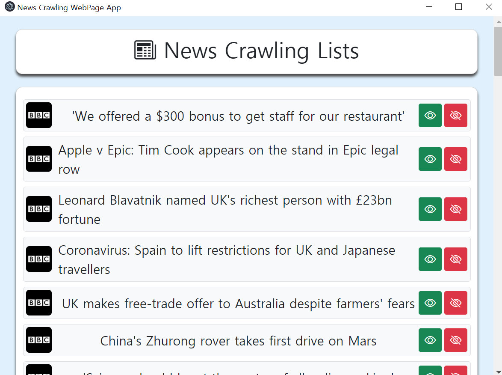

# News Crawling Project

## The repository

This repository is the project for OSS-project. In this project, we show the **news article**. We show 3 popular sites.
* [Naver news](https://news.naver.com)
* [BBC news](https://www.bbc.com/news)
* [WSJ news](https://www.wsj.com/?gclid=Cj0KCQjw16KFBhCgARIsALB0g8JIY_jUFysTAgway0DZH_u1LvYb6Viz5_c5OAI2V7hvRkE8I5da0mMaApqIEALw_wcB&mod=acqsearch&gclsrc=aw.ds&ef_id=YCUQlwAAAE4SAFZV:20210523065056:s)

Our purpose is **"Don't need to access each news sites to get the issues".** With this program, **You can get hot issues in 3 sites at one time!**
We also show each theme hot topics, such as **science, technology, world, business, etc.**

## Start the program
You can see like this

