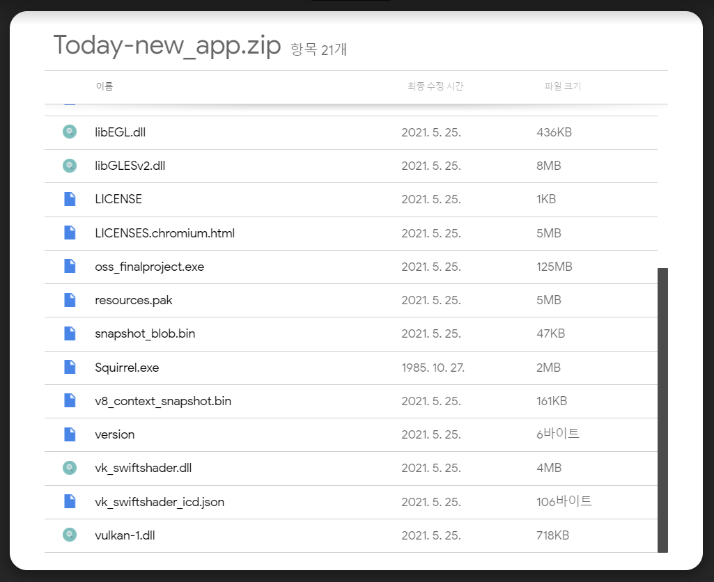
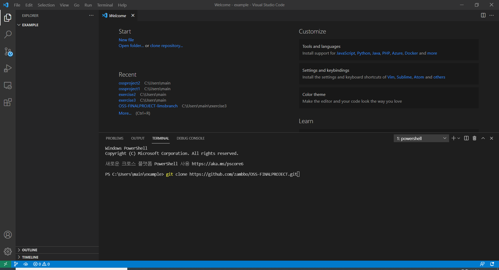
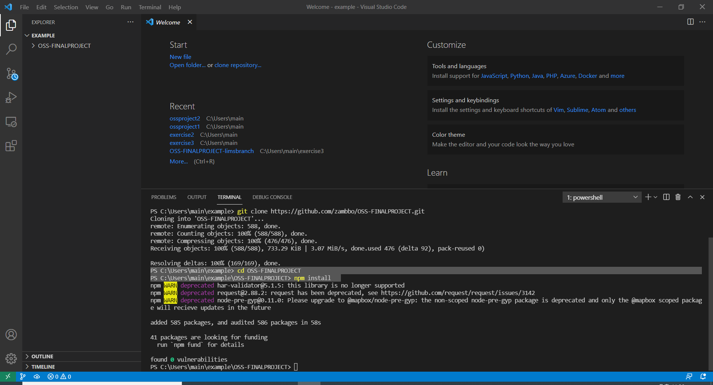
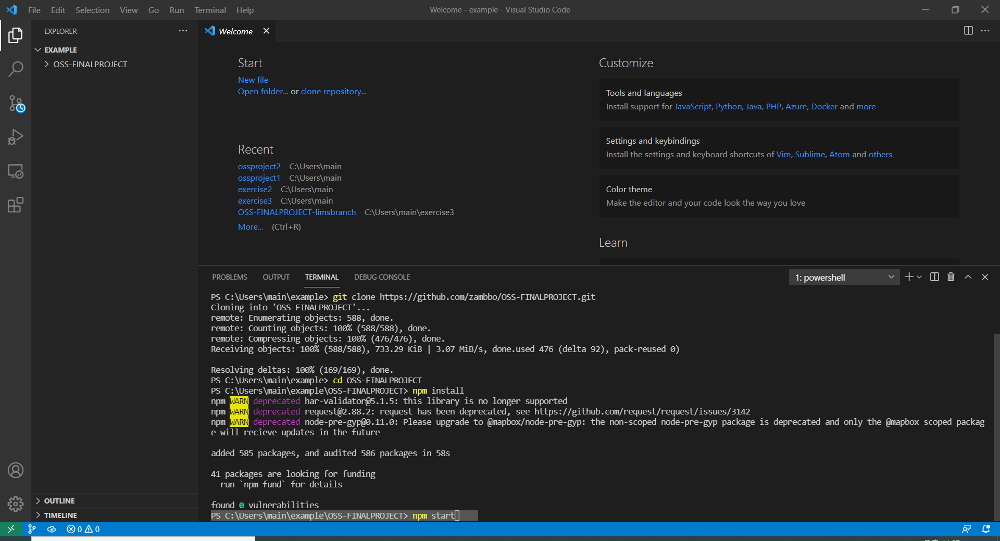

# News Crawling Project

## The repository

This repository is the project for OSS-project. In this project, we show the **news article**. We show 3 popular sites.
* [Naver news](https://news.naver.com)
* [BBC news](https://www.bbc.com/news)
* [WSJ news](https://www.wsj.com/?gclid=Cj0KCQjw16KFBhCgARIsALB0g8JIY_jUFysTAgway0DZH_u1LvYb6Viz5_c5OAI2V7hvRkE8I5da0mMaApqIEALw_wcB&mod=acqsearch&gclsrc=aw.ds&ef_id=YCUQlwAAAE4SAFZV:20210523065056:s)

Our purpose is **"Don't need to access each news sites to get the issues".** With this program, **You can get hot issues in 3 sites at one time!**
We also show each theme hot topics, such as **science, technology, world, business, etc.**


## How to use
You can see like this.
The name of this app is **Today-news**


There are **green, red buttons**.  

You can delete particular articles by clicking **red button**.

You can see the article contents when you click **green button**.
There are also the link for that article too.


## Demo Video Link
[Group12 Demo Video](https://youtu.be/TZlyC6lbsX4)

## Installation Instruction
You have two ways for this!

* You can download this app through this [Download "Today-news" application](https://drive.google.com/file/d/1mgjjtm5pwPxhAWdS9MZk5pOuOZa5dUGu/view?usp=sharing)


You can run this app by run the **oss_finalproject.exe**

* After **git clone** this repositry, do ```npm install```. And then, if you do ```npm start```, you can start this app

### Let me show in detail.

### step 1
* Open the new folder where you want to download this application.
Then, do ```git clone [This repositry https]```



### step 2
* Then, a folder will appear. Go into that directory by entering ```cd OSS_FINALPROJECT```.
After that, do ```npm install```.



### step 3
* After you install successfully, Just enter **npm start**
Then a new window will pop up.



```vscode
npm install
```


## Version
1.0.0

## License

Copyright (c) Microsoft Corporation. All rights reserved.

Licensed under the [MIT](LICENSE.txt) license.
